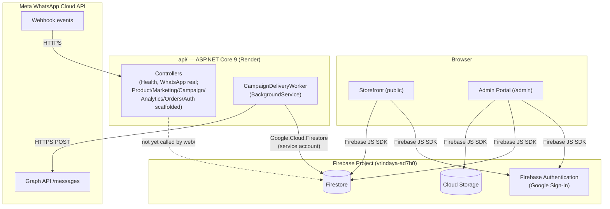
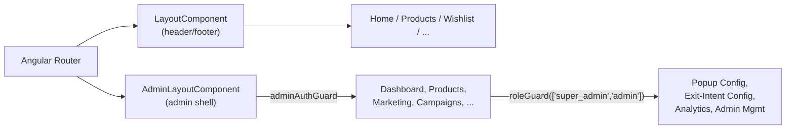
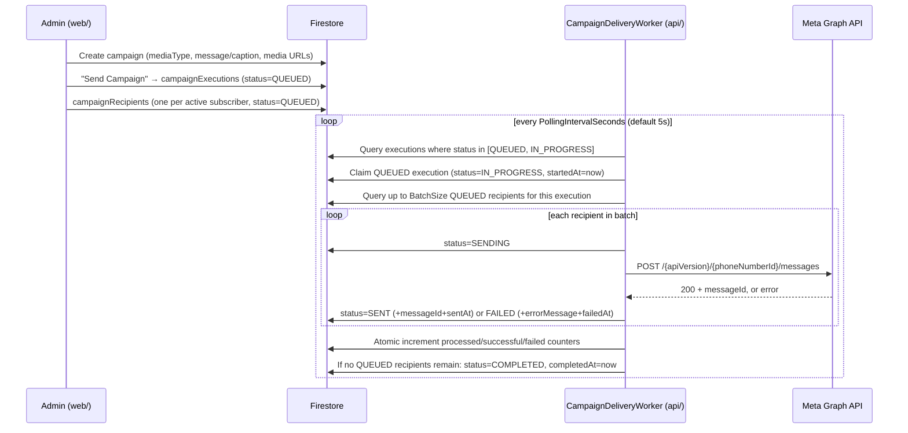
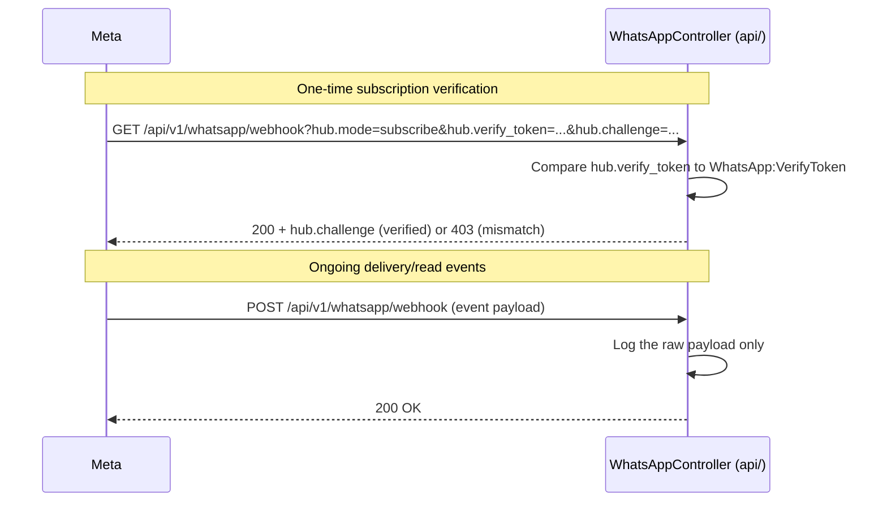

# Architecture

This document describes the actual, current architecture of the Vrindaya
platform as implemented — not a target state. For the historical
reasoning behind individual decisions, see the deeper-dive docs linked
throughout (`docs/architecture/`, `docs/marketing/`).

## Table of Contents

- [System Overview](#system-overview)
- [High-Level Architecture](#high-level-architecture)
- [Monorepo Structure](#monorepo-structure)
- [Angular Architecture](#angular-architecture)
- [.NET API Architecture](#net-api-architecture)
- [Firebase Architecture](#firebase-architecture)
- [Firestore Collections](#firestore-collections)
- [WhatsApp Integration Flow](#whatsapp-integration-flow)
- [Background Worker](#background-worker)
- [Webhook Flow](#webhook-flow)
- [Dependency Injection](#dependency-injection)
- [Folder Structure](#folder-structure)

## System Overview

Vrindaya is a fashion e-commerce storefront with an integrated WhatsApp
marketing platform. It is a **monorepo with two independently deployable
applications** that share one Firebase project as their common data layer:

- **`web/`** — Angular 21. Storefront (catalog, wishlist) and an admin
  portal (product management, marketing/campaign tools). Talks to
  Firestore/Storage/Auth directly via the Firebase JS SDK — there is no
  AngularFire dependency and no backend-mediated data access for these
  features today.
- **`api/`** — ASP.NET Core 9 Web API. Started as an infrastructure-only
  foundation (versioning, logging, exception handling, health checks) with
  every controller except `Health` scaffolded but empty. It has since
  grown its first real feature: a background worker that reads campaign
  data from Firestore and sends WhatsApp messages via Meta's Cloud API.

Both apps are independent processes with independent deploy pipelines —
`web/` does not call `api/` for any of its current features, and `api/`
does not serve any page for `web/`. They are connected only by reading
and writing the same Firestore database.

## High-Level Architecture



## Monorepo Structure

```
Vrindaya/
├── web/            Angular 21 application — deployed to Vercel
├── api/             ASP.NET Core 9 Web API — deployed to Render
├── docs/             Documentation (this folder)
├── firebase.json     Points at the two rules files below
├── firestore.rules   Firestore Security Rules (shared infrastructure)
└── storage.rules     Cloud Storage Security Rules (shared infrastructure)
```

`firebase.json`/`firestore.rules`/`storage.rules` live at the repo root,
outside both `web/` and `api/`, because they are project-wide
infrastructure neither app owns exclusively — `web/` is Firestore's
current only writer, but `api/`'s worker is a reader/writer too, and both
depend on the same rules being correct.

Full rationale: [docs/architecture/system-architecture.md](architecture/system-architecture.md).

## Angular Architecture

- **Standalone components** throughout — no `NgModule`s anywhere in the
  application.
- **Signals, not RxJS, for state.** Services expose `signal`/`computed`
  state; components read it directly in templates. RxJS is used only
  where the platform genuinely requires it (Router events, `toObservable()`
  bridging in route guards).
- **`components/` vs `features/`**: `components/` holds homepage-only
  presentational sections wired directly into the home page template;
  `features/` holds anything with its own route, each owning a
  `*.routes.ts` file.
- **`@defer` blocks** lazy-load below-the-fold homepage sections and
  rarely-used overlays (e.g. the Insider exit-intent modal), keeping them
  out of the initial bundle.
- **No AngularFire.** Every Firestore/Storage/Auth call uses the raw
  `firebase` SDK via dynamic `import()` inside service methods, guarded by
  `isPlatformBrowser()` so Firebase never executes during SSR.
- **Admin portal** (`features/admin/`) is a sibling top-level route tree,
  not a separate app — it has its own layout, its own route guards
  (`adminAuthGuard`, `roleGuard`), and is marked `RenderMode.Client` in
  `app.routes.server.ts` (never server-rendered, since it depends on
  Firebase Auth state and `localStorage`).



Full detail: [docs/architecture/frontend-architecture.md](architecture/frontend-architecture.md).

## .NET API Architecture

Single project, folder-per-layer (not multiple class-library projects —
there is no cross-cutting reuse need yet that would justify the ceremony
of separate assemblies).

| Folder | Responsibility |
| --- | --- |
| `Controllers/` | HTTP endpoints — thin, delegate to a service, no business logic |
| `Interfaces/` | Contracts (`I*Service`, `I*Provider`, `I*Repository`) — what DI and controllers depend on |
| `Services/` | Implementations. `WhatsApp/` and `CampaignDelivery/` have real logic; the rest are empty scaffolding behind their interface |
| `Models/` | Firestore document POCOs (`[FirestoreData]`) — a different boundary from `DTOs/` |
| `DTOs/` | HTTP request/response shapes that cross the controller boundary |
| `Configuration/` | Strongly typed Options classes (Options pattern) |
| `Middleware/` | `GlobalExceptionMiddleware` (real), `TokenValidationMiddleware` (reserved pass-through) |
| `Extensions/` | DI composition root and pipeline wiring, kept out of `Program.cs` |
| `Constants/` | Literal values and status-string constants shared across the app |
| `Validators/` | Custom `ValidationAttribute`s (e.g. phone number format) |
| `Common/` | Shared response envelopes (`ApiErrorResponse`) |

**Only two feature areas have real implementations**: WhatsApp
(`Services/WhatsApp/`, `Controllers/WhatsAppController.cs`) and campaign
delivery (`Services/CampaignDelivery/`, a background worker with no
controller at all). `Product`, `Marketing`, `Campaign`, `Analytics`,
`Orders`, and `Auth` controllers exist, are registered in DI, and are
constructor-injected against their interface — but have zero implemented
actions. This is deliberate, staged scaffolding, not incomplete/broken
code — see [Completed Features](roadmap/completed-features.md).

Full detail: [docs/architecture/backend-architecture.md](architecture/backend-architecture.md).

## Firebase Architecture

One Firebase project (`vrindaya-ad7b0`) is the system's single source of
truth for data:

- **Authentication** — Google Sign-In, used only by the Angular admin
  portal. Authorization is a single hardcoded admin email
  (`AdminAuthService.ADMIN_EMAIL`), checked client-side and mirrored in
  `firestore.rules`'/`storage.rules`' `isAdminUser()` helper. There is a
  Firestore-backed `admin-users` collection and matching Angular UI for a
  future multi-admin model, but it is **not wired into the actual
  authorization decision** — see [Firestore Schema](database/firestore-schema.md#admin-users).
- **Firestore** — every collection below. Written directly by `web/` via
  the Firebase JS SDK; read/written by `api/`'s `CampaignDeliveryWorker`
  via the Firebase Admin (`Google.Cloud.Firestore`) SDK using a
  service-account credential — the two paths use different SDKs but the
  same project and rules.
- **Cloud Storage** — campaign media (`campaign-images/`,
  `campaign-videos/`, `campaign-documents/`), public read (Meta must fetch
  the URL) and admin-only write, capped at Meta's own Cloud API media size
  limits per type.

Full detail: [docs/FIREBASE_SETUP.md](FIREBASE_SETUP.md), [docs/database/firestore-schema.md](database/firestore-schema.md).

## Firestore Collections

| Collection | Doc ID | Public surface | Written by |
| --- | --- | --- | --- |
| `marketingSubscribers` | mobile number | `create` (whitelisted) + single-doc `get` public; `list`/`update`/`delete` admin-only | `web/` (public sign-up + admin bulk import) |
| `campaigns` | auto | none — fully admin-gated | `web/` (admin) |
| `campaignTemplates` | auto | none | `web/` (admin, self-seeds 6 defaults) |
| `whatsappSettings` | `default` (singleton) | none | `web/` (admin) |
| `campaignQueue` | auto | none | `web/` (admin) — legacy Phase 2 fan-out, **not processed by anything today** |
| `testMessages` | auto | none | `web/` (admin "Send Test" — records intent only) |
| `campaignExecutions` | auto | none | `web/` (creates as `QUEUED`); `api/`'s worker (claims → `IN_PROGRESS`/`COMPLETED`/`FAILED`, updates counters) |
| `campaignRecipients` | auto | none | `web/` (creates as `QUEUED`, one per subscriber per execution); `api/`'s worker (updates status/messageId/errorMessage/timestamps) |
| `admin-users` | email | none defined — falls through to deny-by-default | `web/` (admin UI exists but the collection has no rules and isn't consulted for auth) |

Every admin-gated collection uses the identical rule shape:
`allow read, write: if isAdminUser();`. See
[Firestore Schema](database/firestore-schema.md) for full field-level
detail per collection.

## WhatsApp Integration Flow



The message type sent (`text`/`image`/`video`/`document`) is chosen per
campaign from its `mediaType` field — see
[Media Campaigns](marketing/campaign-module.md#media-campaigns). No
template-based sending, placeholder substitution, or interactive/button
messages are implemented — see
[WhatsApp Integration Plan](marketing/whatsapp-integration-plan.md) for
the complete, honest accounting of what's built versus what remains.

## Background Worker

`CampaignDeliveryWorker` (`api/Services/CampaignDelivery/CampaignDeliveryWorker.cs`)
is a .NET `BackgroundService` — registered via `AddHostedService<T>()`, it
starts with the application and runs for its entire lifetime, independent
of any HTTP request.

- **Polling**: a `PeriodicTimer` ticks every `CampaignDelivery:PollingIntervalSeconds`
  (default 5). Each tick resolves `ICampaignDeliveryRepository` and
  `IWhatsAppProvider` from a **fresh DI scope** (`IServiceScopeFactory.CreateScope()`)
  — necessary because the worker itself is a singleton but its
  dependencies are Scoped/Transient.
- **Batching**: up to `CampaignDelivery:BatchSize` (default 20) recipients
  are processed per execution per tick.
- **Cancellation**: the execution's live status is re-checked before every
  batch *and* before every individual recipient send — setting
  `campaignExecutions.status` to `CANCELLED` (currently only possible by
  editing Firestore directly; no Angular UI trigger exists yet) stops
  processing immediately, even mid-batch.
- **Failure isolation**: a single recipient's failure (Meta rejection or
  exception) never aborts the batch; an unexpected exception at the
  batch level marks the whole execution `FAILED` and is logged.

Full detail: [docs/marketing/campaign-module.md#background-delivery-worker](marketing/campaign-module.md#background-delivery-worker).

## Webhook Flow



The verification handshake is fully implemented. Incoming delivery/read
events are **logged only** — nothing updates `campaignRecipients.status`
to `DELIVERED`/`READ` yet. This is a deliberate, documented gap (see
[Future Roadmap](RELEASE_NOTES_v1.0.0-beta.md#future-roadmap)), not an
oversight.

## Dependency Injection

`api/`'s composition root is `Extensions/ServiceCollectionExtensions.cs`,
called once from `Program.cs`:

```csharp
builder.Services.AddApplicationOptions(builder.Configuration);  // Options pattern bindings
builder.Services.AddApplicationServices();                      // I*Service registrations
builder.Services.AddWhatsAppIntegration();                       // typed HttpClient for Meta
builder.Services.AddCampaignDeliveryWorker();                     // hosted BackgroundService
builder.Services.AddCorsPolicy(builder.Configuration);
builder.Services.AddApiVersioningSupport();
builder.Services.AddHealthChecks();
```

| Registration | Lifetime | Why |
| --- | --- | --- |
| `IDateTimeProvider` | Singleton | Stateless, trivially thread-safe |
| `IHealthService`, `IAuthService`, `IProductService`, `IMarketingService`, `ICampaignService`, `IWhatsAppService`, `IAnalyticsService`, `IOrderService` | Scoped | Standard per-request lifetime |
| `IFirebaseService` | Singleton | Wraps one lazily built, reused `FirestoreDb` client — same reasoning as reusing an `HttpClient` rather than rebuilding per call |
| `ICampaignDeliveryRepository` | Scoped | Resolved from a fresh scope inside the worker's poll loop |
| `IWhatsAppProvider` | Transient (via `AddHttpClient<TClient,TImpl>`) | Typed-client registrations default to Transient; connection pooling is handled by `IHttpClientFactory`, not the DI lifetime |
| `CampaignDeliveryWorker` | Singleton (`IHostedService`) | Framework requirement for all hosted services |

A singleton (`CampaignDeliveryWorker`) cannot hold a direct reference to a
Scoped service — it resolves `ICampaignDeliveryRepository`/`IWhatsAppProvider`
from `IServiceScopeFactory.CreateScope()` on every poll tick instead of
injecting them into its constructor. This is the standard .NET pattern for
a long-running service with scoped dependencies; reuse it for any future
background worker rather than reinventing it.

## Folder Structure

See [PROJECT_STRUCTURE.md](PROJECT_STRUCTURE.md) for the complete,
annotated file tree of both applications.
