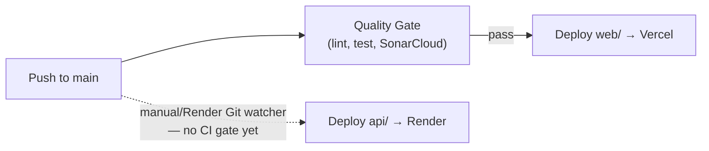

# Deployment



`web/` and `api/` deploy independently, to different platforms, with
different levels of automation.

## Angular Deployment (Vercel)

| Setting | Value |
| --- | --- |
| Root Directory | `web` |
| Framework Preset | Angular |
| Build Command | `npm run build` |
| Output Directory | Angular's default (`dist/vrindaya/browser`) |

Production deploys are **not** triggered by Vercel's own Git integration
— they run from `.github/workflows/ci.yml`:

1. **Quality Gate** job — `npm ci`, `npm run lint` (`--max-warnings=0`),
   `npm run test:ci` (Vitest + coverage), SonarCloud scan (fails the job
   if the Quality Gate is red).
2. **Deploy** job — runs only on push to `main`, only after Quality Gate
   passes. Builds production output in CI, then `vercel deploy --prebuilt --prod`
   uploads the already-built `dist/` — Vercel does not rebuild it.

If Vercel's dashboard shows automatic Git deploys still enabled for this
project, disable them — CI is the source of truth for when/how
production deploys happen, and leaving both active risks duplicate
deploys.

**Required GitHub Secrets**: `VERCEL_TOKEN`, `VERCEL_ORG_ID`,
`VERCEL_PROJECT_ID`, `SONAR_TOKEN`.

Security headers and the CSP are defined in `web/vercel.json` — see
[SECURITY.md](SECURITY.md#cors) and
[deployment/vercel-deployment.md](deployment/vercel-deployment.md) for
the full header list and rationale.

## API Deployment (Render)

| Setting | Value |
| --- | --- |
| Root Directory | `api` |
| Runtime | Native .NET (auto-detected from `Vrindaya.Api.csproj`) |
| Build Command | `dotnet publish -c Release -o out` |
| Start Command | `dotnet out/Vrindaya.Api.dll` |

**There is no CI/CD pipeline for `api/` yet.** Render deploys via its own
Git-push watcher with no automated quality gate (no `dotnet build`/
`dotnet test` runs before deploy). This is a known gap — see
[Future Roadmap](RELEASE_NOTES_v1.0.0-beta.md#future-roadmap).

Cold starts: Render's free/starter tiers spin down idle services. The
first request after idle can take several seconds while the instance
restarts — expected infrastructure behavior, not an application bug.

Full guide: [deployment/render-deployment.md](deployment/render-deployment.md).

## Environment Variables

Set these as real environment variables in each platform's dashboard —
never in a committed `appsettings.json`.

### Render (`api/`)

```
ASPNETCORE_ENVIRONMENT=Production
Cors__AllowedOrigins__0=https://vrindaya.vercel.app
FIREBASE_SERVICE_ACCOUNT_JSON=<the service account key file's full JSON contents>
WhatsApp__AccessToken=<meta-access-token>
WhatsApp__PhoneNumberId=<meta-phone-number-id>
WhatsApp__BusinessAccountId=<meta-waba-id>
WhatsApp__VerifyToken=<your-chosen-verify-token>
WhatsApp__ApiVersion=v23.0
CampaignDelivery__BatchSize=20
CampaignDelivery__PollingIntervalSeconds=5
```

`FIREBASE_SERVICE_ACCOUNT_JSON` and `WhatsApp:*` are **required for the
app to actually do anything**, not optional — without a valid
`FIREBASE_SERVICE_ACCOUNT_JSON`, the background worker logs a retryable
error every poll tick (see
[TROUBLESHOOTING.md](TROUBLESHOOTING.md#worker-not-running)) but the API
itself still starts and serves HTTP requests. Note `FIREBASE_SERVICE_ACCOUNT_JSON`
doesn't follow the usual `Firebase__Key` double-underscore convention —
it's remapped into `Firebase:ServiceAccountJson` through the
configuration pipeline (not read directly in application code) — see
[Firebase Setup](FIREBASE_SETUP.md#production).

### Vercel (`web/`)

Angular does not read `process.env` at runtime — its configuration is
compiled into the bundle from `web/src/environments/environment.prod.ts`
at build time. There is no Vercel dashboard environment variable that
affects it; changing `apiBaseUrl`, `adminEmail`, or the Firebase config
means editing that file and redeploying.

Full list and consumers: [setup/environment-variables.md](setup/environment-variables.md).

## Firebase Configuration

- Deploy Firestore/Storage rules from the repo root:
  `firebase deploy --only firestore:rules,storage:rules`.
- This is a manual step today — not part of the CI pipeline. Run it
  whenever `firestore.rules`/`storage.rules` change, before or alongside
  the code deploy that depends on the new rules.

Full guide: [FIREBASE_SETUP.md](FIREBASE_SETUP.md).

## Meta Configuration

- Set the webhook Callback URL to
  `https://<your-render-service>.onrender.com/api/v1/whatsapp/webhook`
  once the Render URL is known.
- Use a **permanent** (system user) access token in production — a
  temporary token expires in ~24 hours and would silently break sending.

Full guide: [META_WHATSAPP_SETUP.md](META_WHATSAPP_SETUP.md).

## Production Checklist

- [ ] `firestore.rules`/`storage.rules` deployed and match the code being
      deployed
- [ ] `FIREBASE_SERVICE_ACCOUNT_JSON` and all `WhatsApp:*` environment
      variables set on Render with real, production values
- [ ] `Cors:AllowedOrigins` includes the actual production Vercel domain
      (and no others)
- [ ] Meta webhook Callback URL points at the actual Render URL, verify
      token matches `WhatsApp:VerifyToken`
- [ ] Production access token is a **permanent** token, not a temporary
      one
- [ ] `web/src/environments/environment.prod.ts`'s `apiBaseUrl` points at
      the real Render URL (if/when `web/` starts calling `api/` directly)
- [ ] Message templates submitted and approved in Meta Business Manager,
      if sending outside the 24-hour customer window is expected (see
      [META_WHATSAPP_SETUP.md](META_WHATSAPP_SETUP.md#known-meta-error-codes))
- [ ] `GET /health` and `GET /api/v1/health` both return healthy after
      deploy (see below)

## Health Check URLs

| Endpoint | Purpose |
| --- | --- |
| `GET /health` | Plain-text `Healthy`/`Unhealthy` — configure this as Render's own infrastructure health check path |
| `GET /api/v1/health` | Rich JSON status for dashboards/monitoring — see [API_REFERENCE.md](API_REFERENCE.md#get-apiv1health) |
| `GET /api/v1/whatsapp/health` | Meta credential configuration status |

```bash
curl https://<your-render-service>.onrender.com/health
curl https://<your-render-service>.onrender.com/api/v1/health
```

## Rollback Strategy

Neither platform has an automated rollback pipeline configured in this
repo today — rollback is a manual operation on each platform:

- **Vercel**: every deploy is immutable and listed in the project's
  Deployments tab. Promote a previous successful deployment back to
  production via the Vercel dashboard ("Promote to Production") or
  `vercel rollback` from the CLI.
- **Render**: the Render dashboard's Deploys tab lists every previous
  deploy for the service — use "Rollback to this deploy" on the last
  known-good one.
- **Firestore rules**: keep the previous `firestore.rules`/`storage.rules`
  available (git history) and re-run
  `firebase deploy --only firestore:rules,storage:rules` against the
  prior version if a rules change causes a production issue. Rules
  changes are not versioned/rolled-back automatically by Firebase.

There is no database migration/rollback concern for Firestore itself —
schema changes in this app are additive (new optional fields), not
destructive migrations, by convention (see
[CONTRIBUTING.md](CONTRIBUTING.md)).
