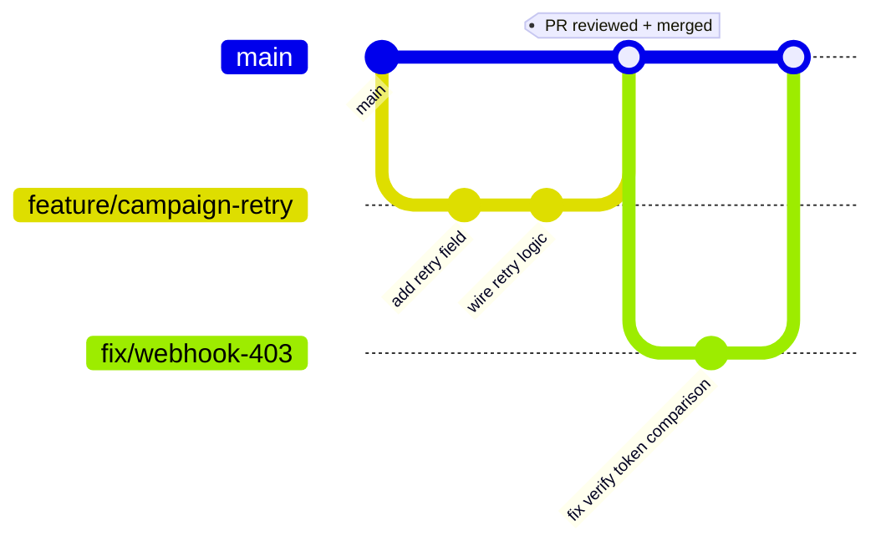

# Development Guidelines

This is the detailed, example-driven reference for how code is actually
written in this repository. For the *process* around contributing a
change (PR checklist, review checklist, the short version of these same
standards), see [CONTRIBUTING.md](CONTRIBUTING.md) — the two documents
are companions, not duplicates: this one goes deeper on *how*, that one
covers *how to submit*.

## Git Flow



This repository uses a **trunk-based** flow, not GitFlow's
`develop`/`release`/`hotfix` branch hierarchy — there is one long-lived
branch (`main`), and every change is a short-lived branch merged back via
pull request:

1. Branch from `main`: `feature/<name>`, `fix/<name>`, `docs/<name>`,
   `chore/<name>`.
2. Commit incrementally with descriptive messages (see
   [Commit Message Convention](#commit-message-convention)).
3. Open a PR into `main`. `angular-build.yml`/`dotnet-build.yml`/
   `quality-check.yml` (and `ci.yml`'s Quality Gate for `web/`) run
   automatically.
4. Merge once checks pass and review is approved. `main`'s merge
   auto-deploys `web/` to Vercel production (see
   [DEPLOYMENT.md](DEPLOYMENT.md)) — there is no staging environment in
   this repo today, so treat every merge to `main` as production-bound
   for `web/`.
5. Delete the branch after merge.

There is no `develop` branch to keep in sync, and no separate release
branches — [.github/workflows/release.yml](../.github/workflows/release.yml)
creates a **draft** GitHub Release (with build artifacts) from whatever
commit you point it at, on demand, without requiring a release branch.

## Branch Strategy

Summarized here; full detail in [CONTRIBUTING.md](CONTRIBUTING.md#branch-strategy).

| Prefix | Use for |
| --- | --- |
| `feature/` | New functionality |
| `fix/` | Bug fixes |
| `docs/` | Documentation-only changes |
| `chore/` | Tooling, dependency bumps, CI/CD, repository infrastructure |

## Naming Conventions

### Angular (`web/`)

| Element | Convention | Example |
| --- | --- | --- |
| Component/service/directive files | kebab-case, `.component.ts`/`.service.ts`/`.directive.ts` suffix (older files sometimes omit `.component`, e.g. `hero.ts` — match the surrounding folder's existing pattern) | `campaign-form.component.ts` |
| Component class names | PascalCase, `Component` suffix | `CampaignFormComponent` |
| Service class names | PascalCase, `Service` suffix | `CampaignExecutionService` |
| Signals | camelCase, no Hungarian prefix; private backing signal prefixed with `_` only where a public read-only wrapper exists | `private readonly _ids = signal(...); readonly ids = this._ids.asReadonly();` |
| Routes files | `<feature>.routes.ts`, exported const `<FEATURE>_ROUTES` | `campaign.routes.ts` → *(inline in admin.routes.ts for this app — see [ARCHITECTURE.md](ARCHITECTURE.md))* |
| Models | `<name>.model.ts`, interface in PascalCase, string-literal union constants in `UPPER_SNAKE_CASE` | `CAMPAIGN_MEDIA_TYPES`, `CampaignMediaType` |
| CSS classes | short component-prefixed abbreviation + BEM-ish modifier (`ct-badge--sent`) | see `campaign-list.component.css` |

### .NET (`api/`)

| Element | Convention | Example |
| --- | --- | --- |
| Namespaces/folders | PascalCase, matching C# convention | `Vrindaya.Api.Services.CampaignDelivery` |
| Interfaces | `I` prefix | `IWhatsAppProvider` |
| Async methods | `Async` suffix | `SendTextMessageAsync` |
| DTOs vs Models | `DTOs/` = HTTP boundary, `Models/` = Firestore document boundary — never share a class between them | `SendMessageRequest` (DTO) vs `CampaignDocument` (Model) |
| Constants mirroring Firestore string literals | PascalCase class, `public const string` fields matching the exact Angular literal | `CampaignRecipientStatus.Sending = "SENDING"` |
| Configuration classes | `<Section>Options`, bound via the Options pattern | `WhatsAppOptions` |

### Firestore

| Element | Convention |
| --- | --- |
| Collection names | camelCase, plural | `campaignRecipients` |
| Field names | camelCase | `processedRecipients`, `mediaType` |
| Status/enum-like string fields | `UPPER_SNAKE_CASE` values | `"IN_PROGRESS"`, `"READY_TO_SEND"` |
| Document IDs | Either a natural key (mobile number for `marketingSubscribers`) or Firestore auto-ID — natural keys are used specifically to enable direct `getDoc()` lookups without a query; see [database/firestore-schema.md](database/firestore-schema.md) |

## Coding Standards

### Angular Standards

- Standalone components only, no `NgModule`s.
- Signals for state; RxJS only where the platform requires it (Router
  events, guard-level `toObservable()` bridging).
- Reactive Forms (`FormBuilder` + `Validators`), never template-driven
  forms.
- No AngularFire — raw `firebase` SDK via dynamic `import()`, guarded by
  `isPlatformBrowser()`.
- Extract, don't duplicate — shared logic goes in `shared/utils/` or a
  shared service, not copy-pasted across components/services (this was a
  specific cleanup item before v1.0.0-beta; see
  [../CHANGELOG.md](../CHANGELOG.md)).

Full detail: [CONTRIBUTING.md](CONTRIBUTING.md#angular-standards),
[architecture/frontend-architecture.md](architecture/frontend-architecture.md).

### .NET Standards

- Controllers stay thin — no business logic, no direct Firestore/HTTP
  calls, no `try`/`catch` beyond what `GlobalExceptionMiddleware` already
  provides globally.
- Options pattern for all configuration — never read `IConfiguration`
  directly in a service.
- One interface → one implementation → one line in
  `AddApplicationServices()`.
- Every I/O-bound method accepts and forwards a `CancellationToken`.

Full detail: [CONTRIBUTING.md](CONTRIBUTING.md#net-standards),
[architecture/backend-architecture.md](architecture/backend-architecture.md).

## Commit Message Convention

No enforced tooling (no commitlint), but follow this shape:

```
<short, imperative summary, ~50-72 chars>

<optional body: why this change was made, not what — the diff already
shows what changed>
```

Examples from this repository's own history:

```
Add Vrindaya Insider marketing module (ribbon, exit-intent modal, admin dashboard)
fixed prod issue for admin login
```

Prefer the first style (a clear, specific summary of the change's
purpose) over the second (vague, past-tense, no context). Avoid
one-word or placeholder messages (`fix`, `wip`, `updates`).

## Folder Organization

See [PROJECT_STRUCTURE.md](PROJECT_STRUCTURE.md) for the complete,
annotated tree. The two rules worth internalizing:

1. **Angular**: `components/` = homepage-only, no route;
   `features/<name>/` = has its own route and owns a `*.routes.ts`.
2. **.NET**: `Models/` = Firestore document shape; `DTOs/` = HTTP
   request/response shape. A class is never both.

## Review Checklist

See [CONTRIBUTING.md](CONTRIBUTING.md#review-checklist) for the
canonical checklist reviewers use. In short: does this match the
existing pattern for its layer, are Firestore rules updated alongside a
schema change, is anything sensitive being logged, and does the PR
explain *why*.
