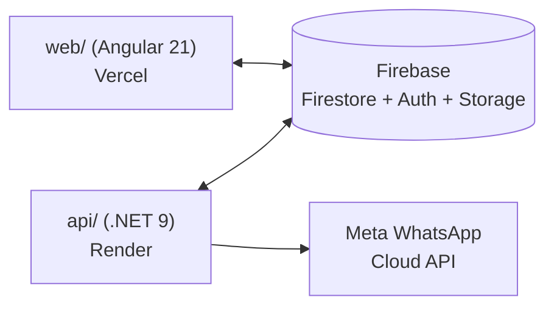

# Release Notes — v1.0.0-beta

**Status**: Beta · See [VERSION.md](../VERSION.md) for the versioning
scheme and [CHANGELOG.md](../CHANGELOG.md) for the itemized change log
this document summarizes.

## Overview

v1.0.0-beta is the first tagged release of the Vrindaya platform in its
current monorepo form: an Angular 21 storefront/admin portal plus an
ASP.NET Core 9 API, sharing one Firebase project, with an end-to-end
WhatsApp marketing pipeline — from subscriber capture through to a
background worker that sends real messages via Meta's Cloud API.

## Major Features

- **Storefront**: product catalog, wishlist, PWA support, SEO.
- **Admin Portal**: Firebase Google Sign-In, product management,
  marketing/campaign tools.
- **Marketing**: subscriber capture (sticky ribbon + exit-intent modal),
  CSV/XLSX bulk import.
- **Campaigns**: compose text/image/video/PDF campaigns, live preview,
  scheduling, template library.
- **Campaign Execution Engine**: per-send tracking (`campaignExecutions`),
  live progress UI.
- **Campaign Recipient Engine**: per-recipient tracking
  (`campaignRecipients`) with filtering, search, pagination, and a
  delivery timeline.
- **Media Campaigns**: image/video/PDF upload with validation matching
  Meta's own size limits, previewed before saving.
- **WhatsApp Cloud API Integration**: real Meta Graph API calls for text,
  image, video, and document messages; webhook verification handshake.
- **Background Delivery Worker**: `CampaignDeliveryWorker`, a .NET
  `BackgroundService` that actually drives campaign sends, with
  cancellation support and atomic stat tracking.

Full detail: [CHANGELOG.md](../CHANGELOG.md).

## Architecture

Monorepo, two independently deployable apps, one shared Firebase project:

`web/` and `api/` never call each other directly today — they're
connected only through Firestore, which `web/` writes via the Firebase
JS SDK and `api/`'s background worker reads/writes via the Firebase
Admin (`Google.Cloud.Firestore`) .NET client. See
[ARCHITECTURE.md](ARCHITECTURE.md) for full detail.

## Known Limitations

These are documented, deliberate scope boundaries for this release, not
defects:

1. **Most real WhatsApp sends will be rejected by Meta** outside a
   24-hour customer-initiated conversation window — template-approved
   sending is not implemented. See
   [META_WHATSAPP_SETUP.md](META_WHATSAPP_SETUP.md#known-meta-error-codes)
   (error `131047`) and
   [marketing/whatsapp-integration-plan.md](marketing/whatsapp-integration-plan.md).
2. **No authentication on `api/` endpoints.** `TokenValidationMiddleware`
   is a reserved pass-through. See [SECURITY.md](SECURITY.md).
3. **No rate limiting** on any `api/` endpoint.
4. **Webhook events are logged only** — Meta's delivery/read receipts do
   not update `campaignRecipients.status` yet.
5. **Placeholder substitution** (`{{name}}`, `{{mobile}}`, etc.) is not
   implemented — campaign messages/captions containing these tokens are
   sent literally.
6. **No subscriber opt-out/unsubscribe flow.**
7. **`campaignQueue` is legacy** — still written on every send, but no
   longer processed by anything (superseded by `campaignRecipients`).
8. **`admin-users` multi-admin model is unwired** — the UI exists; the
   actual authorization check is a single hardcoded email.
9. **No CI/CD quality gate for `api/`** — Render deploys via its own Git
   watcher with no automated build/test check.

## Future Roadmap

Ordered by dependency (see [docs/roadmap/roadmap.md](roadmap/roadmap.md)
for the living version of this list):

1. Meta template-approved sending (highest priority — closes Known
   Limitation #1).
2. Placeholder substitution in campaign messages/captions.
3. Firebase ID token verification in `api/` (`TokenValidationMiddleware`).
4. Rate limiting on `api/`, starting with `POST /api/v1/whatsapp/test`.
5. WhatsApp webhook event processing (delivery/read status updates).
6. Resolve the `admin-users`/`AdminAuthService` split.
7. CI/CD pipeline for `api/`.
8. Campaign audience segmentation; subscriber opt-out flow.
9. Retry support for failed WhatsApp sends (currently one attempt, no
   retry loop).

## Breaking Changes

None within this release relative to the working state immediately
preceding it — this release is a cleanup/documentation/hardening pass
(dead code removal, duplicate-helper consolidation, a `.gitignore` fix
for a secret-leak risk) on top of already-built functionality, not a
functional change. See [CHANGELOG.md](../CHANGELOG.md) for the specific
files touched.

If you are setting this project up for the first time: there is no prior
tagged version to be "breaking" relative to, so this section will start
being meaningful from the next release onward.

## Deployment Notes

- `web/` deploys to Vercel via GitHub Actions after a Quality Gate
  (lint/test/SonarCloud) passes on `main`.
- `api/` deploys to Render via Render's own Git-push watcher — no
  automated quality gate yet (see Known Limitation #9).
- `Firebase:*` and `WhatsApp:*` environment variables are **required**
  for `api/` to do anything beyond serve health checks — without them,
  `CampaignDeliveryWorker` logs a retryable error every poll tick but the
  process itself stays up.
- Firestore/Storage rules are deployed manually
  (`firebase deploy --only firestore:rules,storage:rules`), not as part
  of either CI pipeline.

Full procedures: [DEPLOYMENT.md](DEPLOYMENT.md).
